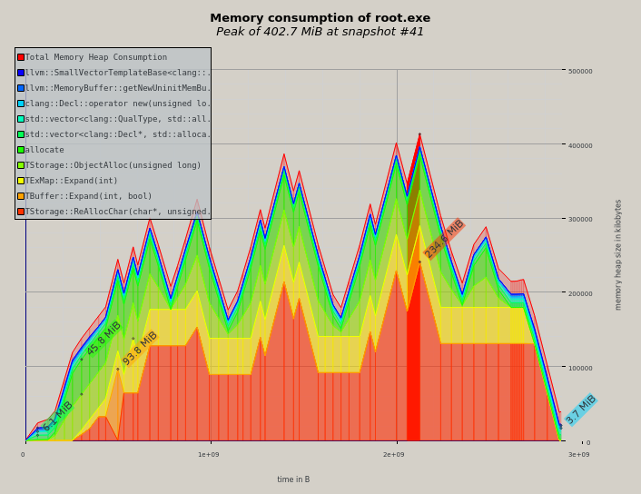
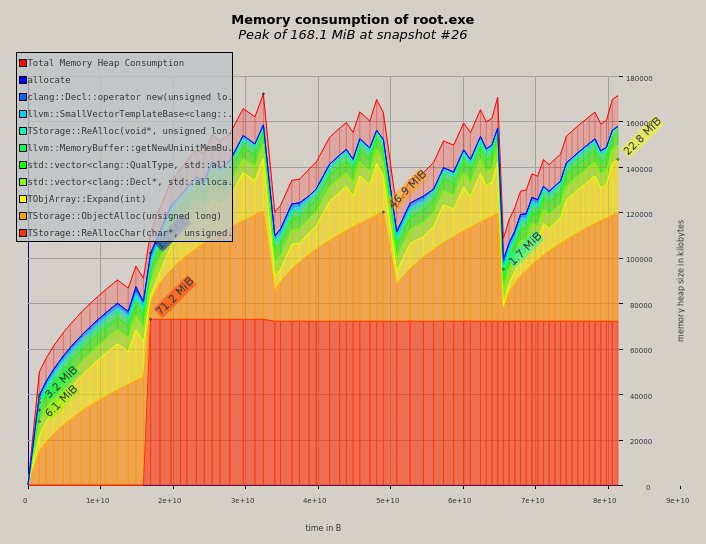

# rootmemory
Test code showing memory usage for STL compared to TClonesArrays for ROOT developers. It is run under SL7.3

usage:
It needs the auto tools (autoconf, automake and libtool from the SL7.3 disribution), ROOTSYS has to be set, root tools need to be in your path  

git clone https://github.com/pinkenburg/rootmemory 
cd rootmemory 
mkdir build 
cd build 
../autogen.sh --prefix=<install area> 
</verbatim>
set ROOT_INCLUDE_PATH to <install area>/include/memsizetest 

start root, on the prompt for the STL Example:  

#include "GenerateSTLHits.h" 
R__LOAD_LIBRARY(libmemsizetest.so) 
  GenerateSTLHits *gen = new GenerateSTLHits(); 
  gen->Init(); 
  gen->Run(5); 
  gen->End(); 
  gSystem->Exit(0); 

for the TClonesArray Example:  

#include "GenerateTCHits.h" 
R__LOAD_LIBRARY(libmemsizetest.so) 
  GenerateTCHits *gen = new GenerateTCHits(); 
  gen->Init(); 
  gen->Run(5); 
  gen->End(); 
  gSystem->Exit(0); 

running this under massif the output from massif-visualizer under ubuntu 16.04.6:  
valgrind --tool=massif --time-unit=B --detailed-freq=1 root.exe

Saving an STL Map in a TTree branch:

Saving the same information in a TClonesArray in a TTree branch:

